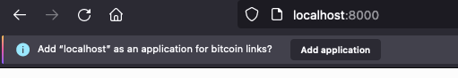
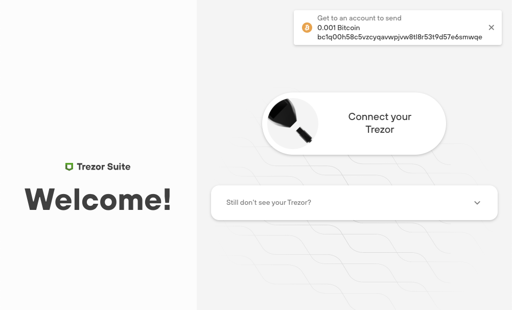
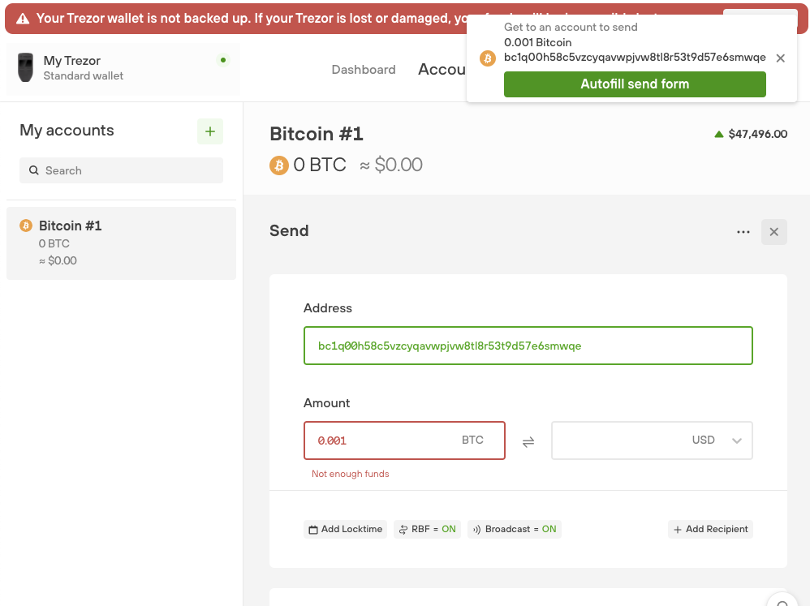

# Coin Protocol Handler
Trezor Suite, both on web and desktop, can handle opening of coin URLs in `coin:address?amount=` format. Currently only `bitcoin:` scheme is supported, but for example `litecoin:` can be easily added.

## Behavior

### Behavior on web
When opening Suite on web, it will prompt the user to associate the opening of `bitcoin:` URLs with Suite. By accepting, all `bitcoin:` URLs in the browser will open Suite. 

### Behavior on desktop
By installing the desktop application, the `bitcoin:` protocol handler will be automatically registered in the system. The user will have the choice to use Suite Desktop to open `bitcoin:` URLs once or always (as default option).

### System behavior (macOS)

1. If the `bitcoin:` handler is registered only by a desktop app. Firefox and Chrome show dialogue if a user wants to open this link using the app.
2. If user has more apps with same handler installed, the behavior is not defined. However, it looks like that the last installed application is started.
3. If the same handler is registered by a desktop app and a web app. Firefox shows dialogue where a user can choose what he wants to open. Chrome opens the web app without asking.

## Structure
The implementation adheres to the [BIP29](https://github.com/bitcoin/bips/blob/master/bip-0021.mediawiki) specification (with the exception of the `label` and `message` parameters).

## Example
[bitcoin:bc1q00h58c5vzcyqavwpjvw8tl8r53t9d57e6smwqe?amount=0.001](bitcoin:bc1q00h58c5vzcyqavwpjvw8tl8r53t9d57e6smwqe?amount=0.001)

## UI

When an app is opened using `bitcoin:` protocol handler, it shows a notification informing a user about stored address and an amount ready to be filled into bitcoin send form.

## Useful links

[Figma](https://www.figma.com/file/hZ22ckyTRlCYRLTNUbTdWO/Exploring-Accounts?node-id=147%3A2605)

[Notion](https://www.notion.so/satoshilabs/BTC-URL-handler-Choose-which-account-from-83d109699a6b45bd98bc4f2fcda73736)

[GitHub](https://github.com/trezor/trezor-suite/issues/3294)

## Handlers manipulation

### Chrome

Navigate to `chrome://settings/handlers` and remove handlers you want.

### Firefox

Navigate to `about:preferences#general` and scroll to `Applications`. Find handler, click on chevron in `Action` column, hit `Application details` and remove apps you want.

### Desktop app - macOS

In terminal `open -a Xcode ~/Library/Preferences/com.apple.LaunchServices/com.apple.launchservices.secure.plist` and delete `bitcoin` handler.